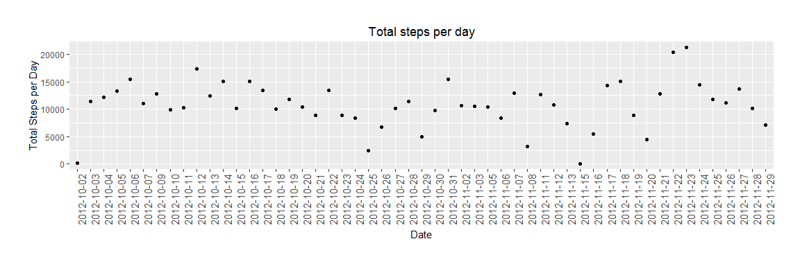

# Reproducible Research: Peer Assessment 1
Dr. M. Teunis  
`r Sys.Date()`  


```r
# Project root
# Package {rprojroot} handles issues with the root in 
# knitting Rmd files.
## install.packages("rprojroot")
library(rprojroot)
```


```r
# Knitr options and defining the root of the project
knitr::opts_chunk$set(echo = TRUE)
ROOT <- find_root_file(criterion = is_rstudio_project)
knitr::opts_knit$set(root.dir = ROOT)
```


```r
## install.packages("dplyr", dependencies = TRUE)
## install.packages("readr")
## install.packages("ggplot2")
## install.packages("pander")

library(dplyr)
library(readr)
library(ggplot2)
library(pander)
```

## Loading and preprocessing the data

### Unzipping the activity.zip file

```r
data_file <- paste0(ROOT, "/activity.zip") 
unzip(zipfile = data_file, exdir = "./data" )
```

### Reading the datafile
For reading, cleaning and subsetting the data I use the 'Hadley' verse packages: {readr}, {dplyr}.

```r
activity <- read_csv(file = "./data/activity.csv")
```

```
## Parsed with column specification:
## cols(
##   steps = col_integer(),
##   date = col_date(format = ""),
##   interval = col_integer()
## )
```

### Removing NAs

```r
activity <- na.omit(activity)
```

### Inspecting the activity dataframe

```r
head(activity)
```

```
## # A tibble: 6 × 3
##   steps       date interval
##   <int>     <date>    <int>
## 1     0 2012-10-02        0
## 2     0 2012-10-02        5
## 3     0 2012-10-02       10
## 4     0 2012-10-02       15
## 5     0 2012-10-02       20
## 6     0 2012-10-02       25
```

```r
glimpse(activity)
```

```
## Observations: 15,264
## Variables: 3
## $ steps    <int> 0, 0, 0, 0, 0, 0, 0, 0, 0, 0, 0, 0, 0, 0, 0, 0, 0, 0,...
## $ date     <date> 2012-10-02, 2012-10-02, 2012-10-02, 2012-10-02, 2012...
## $ interval <int> 0, 5, 10, 15, 20, 25, 30, 35, 40, 45, 50, 55, 100, 10...
```

```r
str(activity)
```

```
## Classes 'tbl_df', 'tbl' and 'data.frame':	15264 obs. of  3 variables:
##  $ steps   : int  0 0 0 0 0 0 0 0 0 0 ...
##  $ date    : Date, format: "2012-10-02" "2012-10-02" ...
##  $ interval: int  0 5 10 15 20 25 30 35 40 45 ...
##  - attr(*, "na.action")=Class 'omit'  Named int [1:2304] 1 2 3 4 5 6 7 8 9 10 ...
##   .. ..- attr(*, "names")= chr [1:2304] "1" "2" "3" "4" ...
```


## What is mean total number of steps taken per day?

### Subsetting and summarize data
Converting $date to character, than to factor

```r
activity$date <- as.character(activity$date) 
activity$date <- as.factor(activity$date)
str(activity)
```

```
## Classes 'tbl_df', 'tbl' and 'data.frame':	15264 obs. of  3 variables:
##  $ steps   : int  0 0 0 0 0 0 0 0 0 0 ...
##  $ date    : Factor w/ 53 levels "2012-10-02","2012-10-03",..: 1 1 1 1 1 1 1 1 1 1 ...
##  $ interval: int  0 5 10 15 20 25 30 35 40 45 ...
##  - attr(*, "na.action")=Class 'omit'  Named int [1:2304] 1 2 3 4 5 6 7 8 9 10 ...
##   .. ..- attr(*, "names")= chr [1:2304] "1" "2" "3" "4" ...
```

Checking the levels of $date.

```r
levels(activity$date)
```

```
##  [1] "2012-10-02" "2012-10-03" "2012-10-04" "2012-10-05" "2012-10-06"
##  [6] "2012-10-07" "2012-10-09" "2012-10-10" "2012-10-11" "2012-10-12"
## [11] "2012-10-13" "2012-10-14" "2012-10-15" "2012-10-16" "2012-10-17"
## [16] "2012-10-18" "2012-10-19" "2012-10-20" "2012-10-21" "2012-10-22"
## [21] "2012-10-23" "2012-10-24" "2012-10-25" "2012-10-26" "2012-10-27"
## [26] "2012-10-28" "2012-10-29" "2012-10-30" "2012-10-31" "2012-11-02"
## [31] "2012-11-03" "2012-11-05" "2012-11-06" "2012-11-07" "2012-11-08"
## [36] "2012-11-11" "2012-11-12" "2012-11-13" "2012-11-15" "2012-11-16"
## [41] "2012-11-17" "2012-11-18" "2012-11-19" "2012-11-20" "2012-11-21"
## [46] "2012-11-22" "2012-11-23" "2012-11-24" "2012-11-25" "2012-11-26"
## [51] "2012-11-27" "2012-11-28" "2012-11-29"
```

Subsetting and calculating steps per day, using the pipe (%>%) operator. 

```r
library(dplyr)
activity$steps <- as.numeric(activity$steps)
tot_steps_pd <- activity %>%
            group_by(date) %>% 
            summarise(total_steps = sum(steps))
```

### Plotting total steps per day

```r
library(ggplot2)
# function to save ggplot2 plots
# this function takes the argument imageDirectory and filename as arguments

str(tot_steps_pd)
```

```
## Classes 'tbl_df', 'tbl' and 'data.frame':	53 obs. of  2 variables:
##  $ date       : Factor w/ 53 levels "2012-10-02","2012-10-03",..: 1 2 3 4 5 6 7 8 9 10 ...
##  $ total_steps: num  126 11352 12116 13294 15420 ...
##  - attr(*, "na.action")=Class 'omit'  Named int [1:2304] 1 2 3 4 5 6 7 8 9 10 ...
##   .. ..- attr(*, "names")= chr [1:2304] "1" "2" "3" "4" ...
```

```r
tot_steps_pd$date <- as.factor(tot_steps_pd$date)
names(tot_steps_pd)
```

```
## [1] "date"        "total_steps"
```

```r
# creating image directory
dir.create(paste0(ROOT, "/images"))
```

```
## Warning in dir.create(paste0(ROOT, "/images")): 'C:\RWorkingDir\Projects
## \assignment_peer_repres\images' already exists
```

```r
imageDirectory <- paste0(ROOT, "./images")
saveInImageDirectory<-function(imageDirectory,filename){
  imageFile <- file.path(imageDirectory, filename)
  ggsave(imageFile, dpi = 300, width = 8, height = 6)	
}

# plotting total steps per day
p <- ggplot(data = tot_steps_pd, aes(date, total_steps))
graph <- p + geom_point() +
  theme(plot.margin = unit(c(1,1,1,1), "cm")) +
      theme(axis.text.x = element_text(size=11, angle=90)) +
            labs(title = "Total steps per day") +
                  xlab("Date") + 
                  ylab("Total Steps per Day")

graph
```

<!-- -->


```r
## saving the graph in "./images"
saveInImageDirectory(imageDirectory = imageDirectory,
filename = "mean_steps_per_day.png")
```

### Calculating and report mean and median of total number of steps per day

```r
activity$steps <- as.numeric(activity$steps)
activity$interval <- as.numeric(activity$interval)

mean_median_steps_pd <- activity %>%
            group_by(date) %>% 
            summarise(mean_steps = mean(steps), 
                      median_steps = median(steps))

overall_mean <- mean(mean_median_steps_pd$mean_steps)
overall_median <- mean(mean_median_steps_pd$median_steps)

pander(cbind(overall_mean, overall_median))
```


-------------------------------
 overall_mean   overall_median 
-------------- ----------------
    37.38             0        
-------------------------------


## What is the average daily activity pattern?


## Imputing missing values


## Are there differences in activity patterns between weekdays and weekends?
