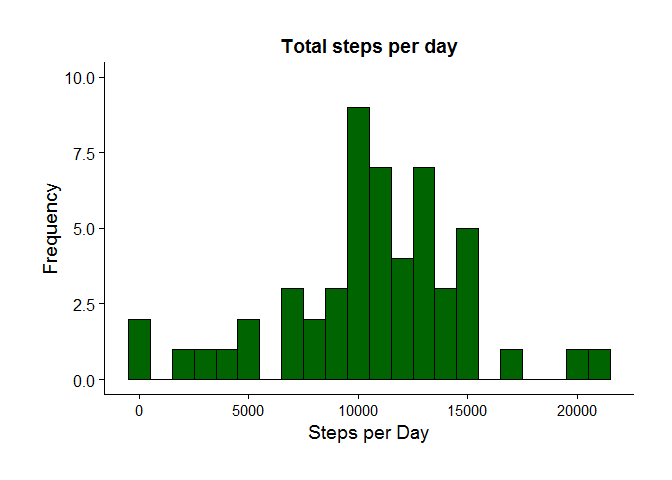
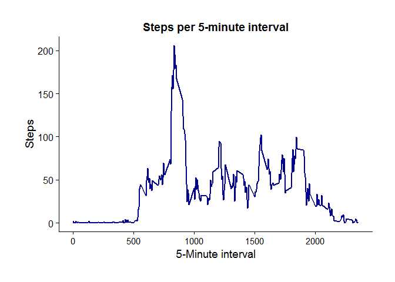
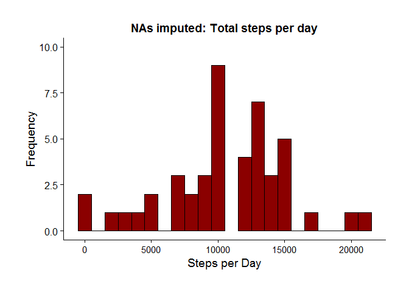
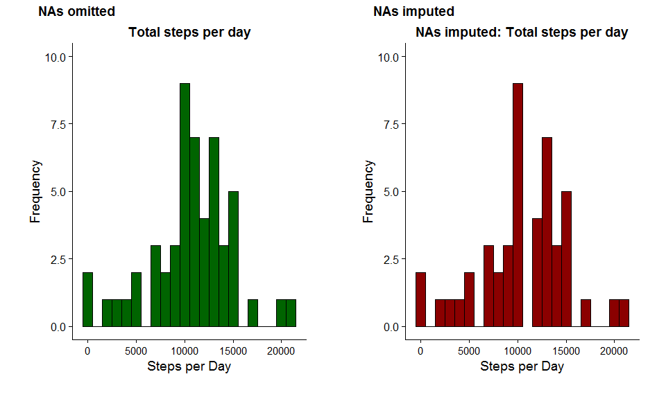
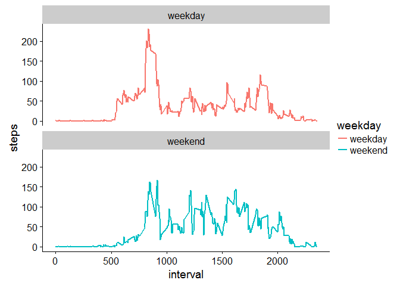

# Reproducible Research: Peer Assessment 1
Dr. M. Teunis  
`r Sys.Date()`  

## System and document settings

```r
# Project root
# Package {rprojroot} handles issues with the root in 
# knitting Rmd files.
## install.packages("rprojroot")
library(rprojroot)
```


```r
# Knitr options and defining the root of the project
knitr::opts_chunk$set(echo = TRUE)
ROOT <- find_root_file(criterion = is_rstudio_project)
knitr::opts_knit$set(root.dir = ROOT)
```

## Packages

```r
## install.packages("dplyr", dependencies = TRUE)
## install.packages("readr")
## install.packages("ggplot2")
## install.packages("pander")
## install.packages("lubridate")
## install.packages("gridExtra")
## install.packages("cowplot")

library(dplyr)
library(readr)
library(ggplot2)
library(pander)
library(lubridate)
library(gridExtra)
library(cowplot)
```

## Loading and preprocessing the data

### Unzipping the activity.zip file

```r
data_file <- paste0(ROOT, "/activity.zip") 
unzip(zipfile = data_file, exdir = "./data" )
```

### Reading the datafile
For reading, cleaning and subsetting the data I use the 'Hadley' verse packages: `{readr}`, `{dplyr}`.
The package `{lubridate}` handles time-formats in data


```r
activity <- read_csv(file = "./data/activity.csv")
```

```
## Parsed with column specification:
## cols(
##   steps = col_integer(),
##   date = col_date(format = ""),
##   interval = col_integer()
## )
```

### Inspecting the activity dataframe

```r
glimpse(activity)
```

```
## Observations: 17,568
## Variables: 3
## $ steps    <int> NA, NA, NA, NA, NA, NA, NA, NA, NA, NA, NA, NA, NA, N...
## $ date     <date> 2012-10-01, 2012-10-01, 2012-10-01, 2012-10-01, 2012...
## $ interval <int> 0, 5, 10, 15, 20, 25, 30, 35, 40, 45, 50, 55, 100, 10...
```

```r
str(activity)
```

```
## Classes 'tbl_df', 'tbl' and 'data.frame':	17568 obs. of  3 variables:
##  $ steps   : int  NA NA NA NA NA NA NA NA NA NA ...
##  $ date    : Date, format: "2012-10-01" "2012-10-01" ...
##  $ interval: int  0 5 10 15 20 25 30 35 40 45 ...
##  - attr(*, "spec")=List of 2
##   ..$ cols   :List of 3
##   .. ..$ steps   : list()
##   .. .. ..- attr(*, "class")= chr  "collector_integer" "collector"
##   .. ..$ date    :List of 1
##   .. .. ..$ format: chr ""
##   .. .. ..- attr(*, "class")= chr  "collector_date" "collector"
##   .. ..$ interval: list()
##   .. .. ..- attr(*, "class")= chr  "collector_integer" "collector"
##   ..$ default: list()
##   .. ..- attr(*, "class")= chr  "collector_guess" "collector"
##   ..- attr(*, "class")= chr "col_spec"
```

### Changing the variable `acitvity$date` type to date with `{lubridate}`

```r
activity$date <- ymd(activity$date)
str(activity)
```

```
## Classes 'tbl_df', 'tbl' and 'data.frame':	17568 obs. of  3 variables:
##  $ steps   : int  NA NA NA NA NA NA NA NA NA NA ...
##  $ date    : Date, format: "2012-10-01" "2012-10-01" ...
##  $ interval: int  0 5 10 15 20 25 30 35 40 45 ...
##  - attr(*, "spec")=List of 2
##   ..$ cols   :List of 3
##   .. ..$ steps   : list()
##   .. .. ..- attr(*, "class")= chr  "collector_integer" "collector"
##   .. ..$ date    :List of 1
##   .. .. ..$ format: chr ""
##   .. .. ..- attr(*, "class")= chr  "collector_date" "collector"
##   .. ..$ interval: list()
##   .. .. ..- attr(*, "class")= chr  "collector_integer" "collector"
##   ..$ default: list()
##   .. ..- attr(*, "class")= chr  "collector_guess" "collector"
##   ..- attr(*, "class")= chr "col_spec"
```

### Removing NAs

```r
activity_na_omit <- na.omit(activity)
```

## What is mean total number of steps taken per day?
For this part of the assignment the missing values can be ignored.

 1) Calculate the total number of steps taken per day.
 
 2) Make a histogram of the total number of steps taken each day.
 
 3) Calculate and report the mean and median of the total number of steps taken per day.

### Ad 1. Total number of steps taken per day
Converting the variable `activity$date` to character, than to factor
Subsetting and calculating steps per day, using the pipe (%>%) operator. 

```r
library(dplyr)
tot_steps_pd <- activity_na_omit %>%
            group_by(date) %>% 
            summarise(total_steps = sum(steps))

head(tot_steps_pd, 10)    
```

```
## # A tibble: 10 × 2
##          date total_steps
##        <date>       <int>
## 1  2012-10-02         126
## 2  2012-10-03       11352
## 3  2012-10-04       12116
## 4  2012-10-05       13294
## 5  2012-10-06       15420
## 6  2012-10-07       11015
## 7  2012-10-09       12811
## 8  2012-10-10        9900
## 9  2012-10-11       10304
## 10 2012-10-12       17382
```

### Ad 2. Plotting total steps per day
#### Creating image directory

```r
library(ggplot2)
# function to save ggplot2 plots
# this function takes the argument imageDirectory and filename as arguments

dir.create(paste0(ROOT, "/images"))

imageDirectory <- paste0(ROOT, "./images")
saveInImageDirectory<-function(imageDirectory,filename){
  imageFile <- file.path(imageDirectory, filename)
  ggsave(imageFile, dpi = 300, width = 8, height = 6)	
}
```

#### Plotting total steps per day

```r
p <- ggplot(data = tot_steps_pd, aes(x = total_steps))
HIST <- p + geom_histogram(binwidth = 1000, 
                            colour = "black",
                            fill = "darkgreen") +
  theme(plot.margin = unit(c(1,1,1,1), "cm")) +
      theme(axis.text.x = element_text(size=11)) +
            labs(title = "Total steps per day") +
                  xlab("Steps per Day") + 
                  ylab("Frequency") + ylim(c(0,10))

HIST
```

<!-- -->

#### Saving plot "histogram_steps.png" seperately for reference

```r
## saving " in "./images"
saveInImageDirectory(imageDirectory = imageDirectory,
filename = "histogram_steps.png")
```

### Ad 3. Calculate and report mean and median of total number of steps per day

```r
names(tot_steps_pd)
```

```
## [1] "date"        "total_steps"
```

```r
mean_median_steps <- tot_steps_pd %>%
             summarise(mean_steps = mean(total_steps), 
                      median_steps = median(total_steps))

pander(mean_median_steps)
```


---------------------------
 mean_steps   median_steps 
------------ --------------
  10766.19       10765     
---------------------------

## What is the average daily activity pattern?

 4) Make a time series plot (i.e. type = "l") of the 5-minute interval (x-axis) and the average number of steps taken, averaged across all days (y-axis)

 5) Which 5-minute interval, on average across all the days in the dataset, contains the maximum number of steps?


### Ad 4. Time series of intervals
Summarizing the data using `{dplyr}` and `group_by(interval)`


```r
names(activity_na_omit)
```

```
## [1] "steps"    "date"     "interval"
```

```r
steps_interval <- activity_na_omit %>%
  group_by(interval) %>%
  summarise(mean_steps_interval = mean(steps))

pander(head(steps_interval, 10))
```


--------------------------------
 interval   mean_steps_interval 
---------- ---------------------
    0            1.7169811      

    5            0.3396226      

    10           0.1320755      

    15           0.1509434      

    20           0.0754717      

    25           2.0943396      

    30           0.5283019      

    35           0.8679245      

    40           0.0000000      

    45           1.4716981      
--------------------------------

#### Plotting times series
Using `{ggplot2}` and `geom_line` 


```r
p <- ggplot(data = steps_interval, aes(x = interval, y = mean_steps_interval))
TIME <- p + geom_line(size = 1, color = "darkblue") +
  theme(plot.margin = unit(c(1,1,1,1), "cm")) +
      theme(axis.text.x = element_text(size=11)) +
            labs(title = "Steps per 5-minute interval") +
                  xlab("5-Minute interval") + 
                  ylab("Steps")

TIME
```

<!-- -->

#### Saving plot "interval_time_series.png" seperately for reference

```r
## saving " in "./images"
saveInImageDirectory(imageDirectory = imageDirectory,
filename = "interval_time_series.png")
```

### Ad 5. Which interval has maximum steps 
Using the `which.max` function to determine the interval that contains the most steps


```r
max_steps <- which.max(steps_interval$mean_steps_interval)

row_id_max <- steps_interval[max_steps,]

## which date belongs to this interval
```

The interval 835 has on average the highst number of steps: 
206.17 steps to be precise.

## Imputing missing values

Note that there are a number of days/intervals where there are missing values (coded as NA). The presence of missing days may introduce bias into some calculations or summaries of the data.

 6) Calculate and report the total number of missing values in the dataset (i.e. the total number of rows with NAs)

 7) Devise a strategy for filling in all of the missing values in the dataset. The strategy does not need to be sophisticated. For example, you could use the mean/median for that day, or the mean for that 5-minute interval, etc.

 8) Create a new dataset that is equal to the original dataset but with the missing data filled in.

 9) Make a histogram of the total number of steps taken each day and Calculate and report the mean and median total number of steps taken per day. Do these values differ from the estimates from the first part of the assignment? What is the impact of imputing missing data on the estimates of the total daily number of steps?

### Ad 6. Total number of missing values
The total amount of missing values in the dataset "activity" is 
2304

Which variable holds these NAs?


```r
sum(is.na(activity$steps)) 
```

```
## [1] 2304
```

Aha! All the NAs in the complete dataframe are located in the variable $steps

### Ad 7. A strategy to impute the missing data 

The average steps for each interval can be calculated to fill in the NAS. The function `tapply` can be used to apply a function in (in this case `mean`) to each cell of a dataframe.


```r
# copying original dataframe
activity_imputed <- activity

nas <- is.na(activity_imputed$steps)
mean_each_interval <- tapply(activity_imputed$steps, activity_imputed$interval, 
                             mean, na.rm=TRUE, simplify=TRUE)
```

### Ad 8. The new dataframe with the imputed Nas:

```r
## filling all the Nas with the mean for each interval, indexing from nas
activity_imputed$steps[nas] <- mean_each_interval[as.character(activity_imputed$interval[nas])]
```

Let's see whether we have managed to get rid of the NAs:

```r
sum(is.na(activity_imputed))
```

```
## [1] 0
```
Conclusion, the Nas have been imputed.

### Ad 9. Creating a new histogram and assessing the impact of the impute strategy on the mean and median of the total steps.

#### Summarizing the new dataframe `activity_imputed` using `{dplyr}` and `group_by(interval)`


```r
names(activity_imputed)
```

```
## [1] "steps"    "date"     "interval"
```

```r
tot_steps_pd_imputed <- activity_imputed %>%
            group_by(date) %>% 
            summarise(total_steps = sum(steps))

pander(head(tot_steps_pd_imputed, 10))
```


------------------------
   date     total_steps 
---------- -------------
2012-10-01   10766.19   

2012-10-02    126.00    

2012-10-03   11352.00   

2012-10-04   12116.00   

2012-10-05   13294.00   

2012-10-06   15420.00   

2012-10-07   11015.00   

2012-10-08   10766.19   

2012-10-09   12811.00   

2012-10-10    9900.00   
------------------------

#### Plotting the imputed total steps per day in a histogram

```r
p <- ggplot(data = tot_steps_pd_imputed, aes(x = total_steps))
HIST_imputed <- p + geom_histogram(binwidth = 1000, 
                            colour = "black",
                            fill = "darkred") +
  theme(plot.margin = unit(c(1,1,1,1), "cm")) +
      theme(axis.text.x = element_text(size=11)) +
            labs(title = "NAs imputed: Total steps per day") +
                  xlab("Steps per Day") + 
                  ylab("Frequency") + ylim(c(0,10))

HIST_imputed
```

<!-- -->


Saving plot "histogram_steps_imputed.png" seperately for reference

```r
## saving " in "./images"
saveInImageDirectory(imageDirectory = imageDirectory,
filename = "histogram_steps_imputed.png")
```

Adding the two histograms together for comparison with `gridExtra` and `cowplot`

```r
plot_grid(HIST, HIST_imputed, labels=c("NAs omitted", "NAs imputed"), ncol = 2, nrow = 1)
```

<!-- -->

Saving plot "histograms_panels.png" seperately for reference

```r
## saving " in "./images"
saveInImageDirectory(imageDirectory = imageDirectory,
filename = "histograms_panels.png")
```


#### Assessing differences between mean and median steps in the data with NAs removed and data with NAs imputed


```r
names(tot_steps_pd)
```

```
## [1] "date"        "total_steps"
```

```r
names(tot_steps_pd_imputed)
```

```
## [1] "date"        "total_steps"
```

```r
mean_median_steps <- tot_steps_pd %>%
             summarise(mean_steps = mean(total_steps), 
                      median_steps = median(total_steps))


mean_median_steps_imputed <- tot_steps_pd_imputed %>%
             summarise(mean_steps_imputed = mean(total_steps), 
                      median_steps_imputed = median(total_steps))


mean_median_compare <- cbind(mean_median_steps, mean_median_steps_imputed)

pander(mean_median_compare)
```


-----------------------------------------------------------------------
 mean_steps   median_steps   mean_steps_imputed   median_steps_imputed 
------------ -------------- -------------------- ----------------------
   10766         10765             10766                 10766         
-----------------------------------------------------------------------

#### Conclusion imputation:
We can conclude that the imputation strategy did not change the values for the overall mean and median steps per day, but one step more for the imputed median.

## Are there differences in activity patterns between weekdays and weekends?

10) Create a new factor variable in the dataset with two levels - “weekday” and “weekend” indicating whether a given date is a weekday or weekend day.

11) Make a panel plot containing a time series plot (i.e. type = "l") of the 5-minute interval (x-axis) and the average number of steps taken, averaged across all weekday days or weekend days (y-axis).

### Ad 10. A factor variable for week and weekend days.
Below we will use `dplyr::mutate` and `base::weekdays` to find the weekend and weekdays in the data and to generate an additional variable called `"weekday"` 

```r
str(activity_imputed)
```

```
## Classes 'tbl_df', 'tbl' and 'data.frame':	17568 obs. of  3 variables:
##  $ steps   : num  1.717 0.3396 0.1321 0.1509 0.0755 ...
##  $ date    : Date, format: "2012-10-01" "2012-10-01" ...
##  $ interval: int  0 5 10 15 20 25 30 35 40 45 ...
##  - attr(*, "spec")=List of 2
##   ..$ cols   :List of 3
##   .. ..$ steps   : list()
##   .. .. ..- attr(*, "class")= chr  "collector_integer" "collector"
##   .. ..$ date    :List of 1
##   .. .. ..$ format: chr ""
##   .. .. ..- attr(*, "class")= chr  "collector_date" "collector"
##   .. ..$ interval: list()
##   .. .. ..- attr(*, "class")= chr  "collector_integer" "collector"
##   ..$ default: list()
##   .. ..- attr(*, "class")= chr  "collector_guess" "collector"
##   ..- attr(*, "class")= chr "col_spec"
```

```r
activity_imputed <- activity_imputed %>%
  mutate(weekday = ifelse(weekdays(date) == "Saturday" | weekdays(date) == "Sunday", "weekend", "weekday"))

str(activity_imputed)
```

```
## Classes 'tbl_df', 'tbl' and 'data.frame':	17568 obs. of  4 variables:
##  $ steps   : num  1.717 0.3396 0.1321 0.1509 0.0755 ...
##  $ date    : Date, format: "2012-10-01" "2012-10-01" ...
##  $ interval: int  0 5 10 15 20 25 30 35 40 45 ...
##  $ weekday : chr  "weekday" "weekday" "weekday" "weekday" ...
```

```r
activity_imputed$weekday <- as.factor(activity_imputed$weekday)
```
`levels(activity_imputed$weekday)` tels us:

weekday, weekend

Meaning that we now have a factor variable indicating if a date is a weekday, or a weekend day.

### Ad 11. Average steps in the 5-minute interval and use ggplot for making the time series of the 5-minute interval for weekday and weekend, and compare the average steps:


```r
weekend_week_interval <- activity_imputed %>%
  group_by(interval, weekday) %>%
  summarise(steps = mean(steps))
```


```r
WKNDWEEK <- ggplot(weekend_week_interval, aes(x=interval, y=steps, color = weekday)) +
  geom_line(size = 1) +
  facet_wrap(~ weekday, ncol = 1, nrow=2)

WKNDWEEK
```

<!-- -->

Saving plot "wkndweek.png" seperately for reference

```r
## saving " in "./images"
saveInImageDirectory(imageDirectory = imageDirectory,
filename = "wkndweek.png")
```

From the above plot we see a clear difference in activity patterns between weekdays and weekends. The activity pattern for the weekdays seems high in the lower-number intervals (hence earlier in the day). In the weekends the activity is more evenly spread thoughout the day.

Also, the pattern from interval 0 - 500 there is very little activity, indicating the test subject is inactive (during night-time?). 

One thing furthermore is striking: during the weekdays, activity starts quite abruptly, where the activity in the weekends starts more gradually.  
